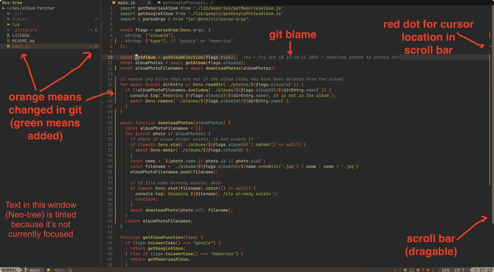

# LazyVim

A starter template for [LazyVim](https://github.com/LazyVim/LazyVim).
Refer to the [documentation](https://lazyvim.github.io/installation) to get started.

## What's so Special About this Starter?

- [ESLint](https://www.lazyvim.org/extras/linting/eslint) formats on save and [typescript-language-server](https://github.com/typescript-language-server/typescript-language-server) has [diagnostics/linting](./lua/config/lazy.lua#L14) with its [formatting disabled](./lua/plugins/lspconfig.lua)
- [Gruvbox](https://github.com/morhetz/gruvbox) [theme](./lua/plugins/colorscheme.lua) (I think it's comfortable on the eyes)
- Absolute line numbers ([relative line numbers disabled](./init.lua#L11))
- Automatic updates disabled (`<leader>l` then `U` to update manually)
- Git plugins - [gitlinker.nvim](https://github.com/ruifm/gitlinker.nvim) (`<leader>gy` to yank link to file) and [git-blame.nvim](https://github.com/f-person/git-blame.nvim)
- [nvim-colorizer.lua](https://github.com/norcalli/nvim-colorizer.lua) to highlight CSS [colors](https://developer.mozilla.org/en-US/docs/Web/CSS/named-color)
- [ToggleTerm](https://github.com/akinsho/toggleterm.nvim) with [`<C-/>`](./lua/plugins/toggleterm.lua) to toggle bottom terminal, `<C-S-/>` for right side terminal
- [Copilot](https://github.com/github/copilot.vim) with the accept keybind as `<C-CR>`
- [nvim-scrollview](https://github.com/dstein64/nvim-scrollview) interactive scrollbar with signs (git diff, diagnostics, etc.)
- [md-pdf.nvim](https://github.com/arminveres/md-pdf.nvim) and [img-clip.nvim](https://github.com/HakonHarnes/img-clip.nvim) for markdown preview/export (`<leader>mp`) and image pasting (`<leader>v`)
- Toggle LSP with `<leader>ue` (`:LspStop`, `:LspStart`)

## Screenshots



## [Installation](https://www.lazyvim.org/installation)

- Make a backup of your current Neovim files:

```sh
# required
mv ~/.config/nvim{,.bak}

# optional but recommended
mv ~/.local/share/nvim{,.bak}
mv ~/.local/state/nvim{,.bak}
mv ~/.cache/nvim{,.bak}
```

- Clone the starter

```sh
git clone https://github.com/zvakanaka/LazyVim-starter ~/.config/nvim
```

- Remove the .git folder, so you can add it to your own repo later

```sh
rm -rf ~/.config/nvim/.git
```

- Start Neovim!

```sh
nvim
```

> [!TIP]
> It is recommended to run `:checkhealth` after installation.
> This will load all plugins and check if everything is working correctly.

I used to refer to [config notes](https://zvakanaka.github.io/#../mere-blog/posts/code/LazyVim.md) whenever setting up Neovim, but a starter started making more sense once I wanted a similar setup on multiple computers.
